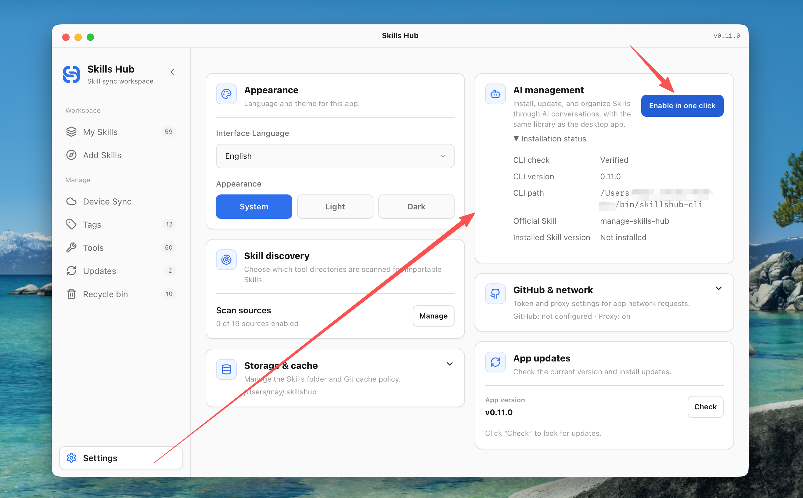
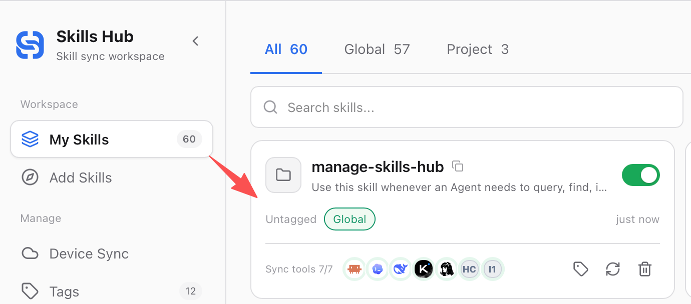

# Skills Hub（Tauri Desktop）

一个跨平台桌面应用（Tauri + React），用于集中安装、整理、更新 Agent Skills，并把它们同步到多个 AI 编程工具的全局或项目级 skills 目录。Skills Hub 会优先使用 symlink/junction，同步失败时自动回退到 copy，实现 “Install once, sync everywhere”。

> English documentation: [`README.md`](../README.md)

## 为什么使用 Skills Hub

AI 编程工具越来越多，每个工具都有自己的 skills 目录和安装方式。手动维护这些目录会带来几个问题：同一个 Skill 要复制多份、更新来源不清楚、不同工具启用状态不一致、批量整理成本高。

Skills Hub 的做法是：把 Skill 统一安装到中心仓库，再按你的选择同步到 Claude Code、Codex、Cursor、OpenCode、Antigravity 等工具。你可以为 Skill 打标签、选择全局或项目范围、批量调整工具目标，也可以让系统定时帮你更新 Git 和本地来源的 Skill。

## 主要功能

- **AI 管理**：通过与 AI 编程工具对话，安装、更新和整理 Skills，与桌面端共用同一份技能库。
- **集中托管**：把 Skill 安装到中心仓库，避免分散在多个工具目录里。
- **探索安装**：从精选列表、在线搜索、本地目录或 Git 仓库安装 Skill。
- **多工具同步**：按全局或项目范围同步到不同 AI 编程工具。
- **多设备库同步**：通过 GitHub、GitLab 或 Gitee 仓库，在多台电脑间同步 Skill 文件、描述和标签。
- **本机回收站**：删除的 Skill 及其本机配置最多保留 30 天，可随时恢复。
- **批量管理**：批量设置标签、工具、启用状态或删除 Skill。
- **标签整理**：用标签筛选、归类和维护 Skill。
- **工具管理**：启用内置工具，也可以添加自定义工具目录。
- **自动更新**：定时更新 Git 和本地来源的 Skill，并查看失败原因。
- **详情查看**：浏览 Skill 文件树、Markdown 内容和代码片段。
- **迁移接管**：扫描并导入本机已有 Skills，统一纳入管理。
- **发现控制**：选择哪些已安装工具目录参与可导入 Skill 扫描。
- **多语言界面**：支持英文、简体中文和韩文界面。

## 界面预览

### My Skills — 托管技能与批量管理

My Skills 通过卡片和列表两种视图展示已托管 Skill 的来源、标签、同步范围、目标工具和启用状态。顶部可以筛选范围、排序、按标签筛选、搜索或执行批量操作。

Skills Hub 在已安装工具目录中发现可导入 Skill 后，会显示发现提示。用户可以查看并导入，或打开“扫描设置”按实际目录控制扫描来源；该设置与同步目标相互独立、重启后保留，并可随时从设置页重新打开。只有包含 `SKILL.md` 的目录会作为可导入 Skill 展示。


### Skill 详情 — 查看内容与同步目标

打开 Skill 可以查看来源、标签、安装范围和同步状态，并通过文件树直接阅读 Markdown 文档或代码，无需离开应用。


### Explore — 精选 Skill 与在线搜索

Explore 汇总精选仓库中的 Skill，并支持在线搜索。点击 Install 后可以继续选择标签、安装范围和目标工具。


### Add Skill — 安装前设置标签、范围和工具

手动添加支持本地目录和 Git 仓库。安装前可以设置标签，选择全局或项目范围，并选择要同步到哪些工具。


### Device Sync — 在多台设备间同步 Skill 库

设备同步可连接 GitHub、GitLab 或 Gitee 仓库。你可以预览变化，手动、启动后、按间隔或每日定时同步，查看逐项历史并处理真实冲突；本机路径、工具目标和凭据不会进入同步仓库。

首次使用时，先授权账号或配置 Token/SSH，再选择仓库并完成首次同步。


连接后，可在主页面查看最近同步状态、自动同步计划，以及每个 Skill 的变更记录。


### Recycle Bin — 恢复已删除的 Skill

删除的 Skill 会在本机回收站保留 30 天。只要原位置仍然可用，恢复时会一并还原文件和已保存的本机配置。


### Tools — 内置与自定义工具管理

工具页集中展示已检测和已启用的 AI 编程工具，并使用对应产品图标增强识别。你可以启用内置目标，也可以为自定义工具配置头像、Skills 目录和明确的同步模式，并在创建后继续编辑。


### Updates — 定时更新与运行结果

更新页可以注册系统级定时任务，在应用关闭时继续更新 Git 和本地来源的 Skill；也可以立即执行更新，并查看最近一次运行的检查、更新和失败数量。


### Settings — 应用级设置

设置页集中管理界面语言、外观、AI 管理、存储与缓存、GitHub Token、网络代理和应用版本更新。


### AI 管理 — 通过对话管理 Skills（v0.11.0 新增）

在 **设置 → AI 管理** 点击 **一键启用**，即可下载并校验对应版本的 CLI、配置终端命令并安装官方 Skill。桌面安装包不包含 CLI；首次启用需要联网，已安装并校验通过的对应版本可离线使用。需要更新时，在设置中点击更新；启动应用不会自动安装或升级组件。CLI 独立文件与桌面安装包放在 [Skills Hub 的同一个 Release](https://github.com/qufei1993/skills-hub/releases) 中。重新打开终端即可使用 `skillshub-cli`；如未生效，请退出并重启终端应用。无需 Node.js 或 npm。终端配置支持 macOS/Linux 的 Bash、Zsh，以及 Windows 用户 PATH。



启用后，「我的 Skills」中会出现 `manage-skills-hub`。让 AI 使用它安装、更新或整理 Skills，与桌面端共用同一份技能库。



不使用桌面端的用户可选择[独立安装 CLI](#独立安装-cli)（不推荐）。

## 工作方式

1. 从 Explore、本地目录或 Git 仓库安装 Skill。
2. 安装前选择标签、同步范围和目标工具。
3. Skills Hub 将 Skill 保存到中心仓库，默认目录为 `~/.skillshub`。
4. 按工具规则同步到全局 skills 目录或项目级 skills 目录。
5. 可以选择连接设备同步，在多台电脑间保持可移植 Skill 库一致。
6. 后续可以在 My Skills 和管理中心批量整理、启停、删除、恢复，或配置自动更新和工具目标。

## 支持的 AI 编程工具

当前内置 48 个工具适配，并支持通过管理中心添加自定义工具目录。项目级 skills 目录相对所选项目根目录；标记为“不支持”的工具尚未确认项目级 skills 目录，仅支持全局同步。

| tool key | 工具 | 全局 skills 目录（相对 `~`） | 项目级 skills 目录（相对项目根目录） | 存在即视为已安装（相对 `~`） |
| --- | --- | --- | --- | --- |
| `cursor` | Cursor | `.cursor/skills` | `.agents/skills` | `.cursor` |
| `claude_code` | Claude Code | `.claude/skills` | `.claude/skills` | `.claude` |
| `codex` | Codex | `.codex/skills` | `.agents/skills` | `.codex` |
| `deepseek_harness` | DeepSeek Harness | `.dsh/skills` | `.dsh/skills` | `.dsh` |
| `zcode` | ZCode | `.zcode/skills` | `.zcode/skills` | `.zcode` |
| `opencode` | OpenCode | `.config/opencode/skills` | `.agents/skills` | `.config/opencode` |
| `antigravity` | Antigravity | `.gemini/config/skills` | `.agents/skills` | `.gemini/config` |
| `amp` | Amp | `.config/agents/skills` | `.agents/skills` | `.config/agents` |
| `kimi_cli` | Kimi Code CLI | `.kimi-code/skills`（或 `$KIMI_CODE_HOME/skills`） | `.kimi-code/skills` | `.kimi-code`（或 `$KIMI_CODE_HOME`） |
| `augment` | Augment | `.augment/skills` | `.augment/skills` | `.augment` |
| `openclaw` | OpenClaw | `.openclaw/skills` | `skills` | `.openclaw` |
| `copaw` | Copaw | `.copaw/skill_pool` | `.copaw/skill_pool` | `.copaw` |
| `cline` | Cline | `.agents/skills` | `.agents/skills` | `.agents` |
| `codebuddy` | CodeBuddy | `.codebuddy/skills` | `.codebuddy/skills` | `.codebuddy` |
| `codewhale` | CodeWhale | `.codewhale/skills` | `.codewhale/skills` | `.codewhale` |
| `workbuddy` | WorkBuddy | `.workbuddy/skills` | `不支持` | `.workbuddy` |
| `command_code` | Command Code | `.commandcode/skills` | `.commandcode/skills` | `.commandcode` |
| `continue` | Continue | `.continue/skills` | `.continue/skills` | `.continue` |
| `crush` | Crush | `.config/crush/skills` | `.crush/skills` | `.config/crush` |
| `junie` | Junie | `.junie/skills` | `.junie/skills` | `.junie` |
| `iflow_cli` | iFlow CLI | `.iflow/skills` | `.iflow/skills` | `.iflow` |
| `kiro_cli` | Kiro CLI | `.kiro/skills` | `.kiro/skills` | `.kiro` |
| `kode` | Kode | `.kode/skills` | `.kode/skills` | `.kode` |
| `mcpjam` | MCPJam | `.mcpjam/skills` | `.mcpjam/skills` | `.mcpjam` |
| `mistral_vibe` | Mistral Vibe | `.vibe/skills` | `.vibe/skills` | `.vibe` |
| `mux` | Mux | `.mux/skills` | `.mux/skills` | `.mux` |
| `openclaude` | OpenClaude IDE | `.openclaude/skills` | `.openclaude/skills` | `.openclaude` |
| `openhands` | OpenHands | `.openhands/skills` | `.openhands/skills` | `.openhands` |
| `pi` | Pi | `.pi/agent/skills` | `.pi/skills` | `.pi` |
| `qoder` | Qoder | `.qoder/skills` | `.qoder/skills` | `.qoder` |
| `qoderwork` | QoderWork | `.qoderwork/skills` | `.qoderwork/skills` | `.qoderwork` |
| `qwen_code` | Qwen Code | `.qwen/skills` | `.qwen/skills` | `.qwen` |
| `trae` | Trae | `.trae/skills` | `.trae/skills` | `.trae` |
| `trae_cn` | Trae CN | `.trae-cn/skills` | `.trae/skills` | `.trae-cn` |
| `zencoder` | Zencoder | `.zencoder/skills` | `.zencoder/skills` | `.zencoder` |
| `neovate` | Neovate | `.neovate/skills` | `.neovate/skills` | `.neovate` |
| `pochi` | Pochi | `.pochi/skills` | `.pochi/skills` | `.pochi` |
| `adal` | AdaL | `.adal/skills` | `.adal/skills` | `.adal` |
| `kilo_code` | Kilo Code | `.kilocode/skills` | `.kilocode/skills` | `.kilocode` |
| `roo_code` | Roo Code | `.roo/skills` | `.roo/skills` | `.roo` |
| `goose` | Goose | `.config/goose/skills` | `.goose/skills` | `.config/goose` |
| `gemini_cli` | Gemini CLI | `.gemini/skills` | `.agents/skills` | `.gemini` |
| `github_copilot` | GitHub Copilot | `.copilot/skills` | `.agents/skills` | `.copilot` |
| `clawdbot` | Clawdbot | `.clawdbot/skills` | `.clawdbot/skills` | `.clawdbot` |
| `droid` | Droid | `.factory/skills` | `.factory/skills` | `.factory` |
| `windsurf` | Windsurf | `.codeium/windsurf/skills` | `.windsurf/skills` | `.codeium/windsurf` |
| `moltbot` | MoltBot | `.moltbot/skills` | `.moltbot/skills` | `.moltbot` |
| `hermes_agent` | Hermes Agent | `.hermes/skills` | 不支持 | `.hermes` |

完整路径规则与检测逻辑见 [`src-tauri/src/core/tool_adapters/mod.rs`](../src-tauri/src/core/tool_adapters/mod.rs)。

## 独立安装 CLI

推荐通过桌面端安装和管理 CLI。以下方式仅供不使用桌面端的用户选择。

<details>
<summary>仅命令行用户手动安装（不推荐）</summary>

不使用桌面端时，可复制对应系统的一条命令安装，无需 Node.js、npm 或管理员权限。

**macOS / Linux**（Intel/AMD x64 或 ARM64）：

```bash
curl -fsSL https://raw.githubusercontent.com/qufei1993/skills-hub/main/scripts/install-cli.sh | bash
```

**Windows x64**（PowerShell）：

```powershell
irm https://raw.githubusercontent.com/qufei1993/skills-hub/main/scripts/install-cli.ps1 | iex
```

脚本从公开的 `qufei1993/skills-hub` 原仓库下载最新正式版，校验 SHA-256，并安装到 macOS/Linux 的 `~/.local/bin` 或 Windows 的 `%LOCALAPPDATA%\SkillsHub\bin`。下载或校验失败会保留已有 CLI。原仓库 Release 中需先有公开可下载的 CLI 版本，安装命令才能使用。

macOS/Linux 安装后请重新打开终端，脚本会自动配置 Bash 和 Zsh；其他 Shell 需自行将 `~/.local/bin` 加入 PATH。Windows 会更新当前 PowerShell 会话和用户 PATH。

验证安装：

```bash
skillshub-cli version --json
skillshub-cli --help
```

升级时重新执行同一条安装命令即可。这份独立 CLI 与桌面端管理的 CLI 分开维护，不会随桌面端自动升级。卸载时删除安装目录中的 `skillshub-cli`（Windows 为 `skillshub-cli.exe`）即可，技能库会保留。

CLI 与桌面端共用本地技能库，但单独安装 CLI 不会自动安装官方 AI 管理 Skill。设备同步、定时任务、账号授权和应用设置仍需使用桌面端。Linux 下载文件面向 GNU/glibc 系统，不适用于 Alpine/musl。

</details>

## 开发

### 环境要求

- Node.js 18+（建议 20+）
- Rust（stable）
- Tauri 系统依赖（按官方文档安装）

首次启动桌面应用或构建安装包前，创建本地 OAuth 配置：

```bash
cp .env.example .env
```

将两个占位值分别替换为团队提供的 GitHub、GitLab OAuth 公开 Client ID。`npm run tauri:dev` 和本地 `npm run tauri:build*` 命令只会从根目录 `.env` 读取这两个白名单字段；进程环境中已存在的对应值优先。两个 ID 都是必填项，以确保两个平台均可使用浏览器授权。不要填写 Client Secret 或用户 Token，也不要提交 `.env`。

### 启动（桌面端）

```bash
npm install
npm run tauri:dev
```

### 构建

```bash
npm run lint
npm run build
# 示例：macOS ARM；其他平台请使用对应的目标三元组。
node scripts/prepare-cli-sidecar.mjs --target aarch64-apple-darwin
npm run tauri:build -- --target aarch64-apple-darwin --cli-manifest src-tauri/binaries/skillshub-cli-aarch64-apple-darwin.json
```

正式构建必须提供与桌面版本、提交和平台一致的 release CLI 清单。上述命令生成本地验证用清单；正式发布由工作流先签名 CLI，再根据最终文件生成清单。所有下方平台命令也必须追加 `-- --cli-manifest <清单路径>`，或设置 `SKILLS_HUB_CLI_MANIFEST_PATH`。开发启动会自动准备本地 CLI，无需此参数。

#### 各系统构建命令（来自 `package.json`）

- macOS（dmg）：`npm run tauri:build:mac:dmg`
- macOS（universal dmg）：`npm run tauri:build:mac:universal:dmg`
- Windows（MSI）：`npm run tauri:build:win:msi`
- Windows（NSIS exe）：`npm run tauri:build:win:exe`
- Windows（MSI+NSIS）：`npm run tauri:build:win:all`
- Linux（deb）：`npm run tauri:build:linux:deb`
- Linux（AppImage）：`npm run tauri:build:linux:appimage`
- Linux（deb+AppImage）：`npm run tauri:build:linux:all`

### 测试（Rust）

```bash
cd src-tauri
cargo test
```

## FAQ / 备注

- Skill 存在哪里？中心仓库（Central Repo）默认是 `~/.skillshub`，可在设置里修改。
- 标签用于什么？标签只用于查找和整理 Skill，不会改变 Skill 的同步目录，也不会改变哪些工具可以使用它。
- 管理中心用于什么？管理中心负责标签、工具目标和 Skills 自动更新；设置页只保留应用级配置。
- 停用 Skill 会删除文件吗？不会。停用只会移除工具侧同步，中心仓库中的 Skill 和配置仍保留，重新启用后可按原工具设置恢复。
- 批量设置工具是什么意思？对选中的 Skill 应用当前勾选的工具列表；未勾选的工具会从这些 Skill 的同步目标中移除。
- 什么是项目级同步？Skill 仍然只在中心仓库保存一份，但同步目标变为指定项目目录，例如 `<project>/.agents/skills`、`<project>/.claude/skills` 或其它工具对应的项目级 skills 路径。
- 自定义工具目录是什么？如果某个内部工具或二次封装 Agent 使用自己的 skills 目录，可以在管理中心添加为自定义同步目标。
- 自动更新会更新什么？自动更新会按配置更新 Git 和本地来源的 Skill，并把更新结果同步到对应工具目标。
- 网络代理影响哪些请求？它是应用外部 HTTP、OAuth、应用更新和远端 Git 操作的统一入口，包括 GitHub、GitLab 与 Gitee 设备同步。
- Cursor 为什么强制 Copy？Cursor 当前不支持软链（symlink/junction）形式的技能目录，因此同步到 Cursor 时会固定使用目录复制（copy）。
- 为什么有时会变成 Copy？默认优先 symlink/junction，但在某些系统（尤其 Windows）可能因为权限/策略导致无法创建链接，会自动回退到目录复制。
- `TARGET_EXISTS|...` 是什么意思？目标目录已存在且默认不覆盖（为了安全）。你需要先清理目标目录，或在“接管/覆盖”的明确流程里重试。
- macOS Gatekeeper 备注（未签名/未公证构建，不同 macOS 版本表现可能不同）：如提示“已损坏/无法验证开发者”，可执行 `xattr -cr "/Applications/Skills Hub.app"`（https://v2.tauri.app/distribute/#macos）。

## 支持的系统

- macOS
- Windows
- Linux（按架构应支持，未做本地验证）

## License

MIT License（见 `LICENSE`）。
