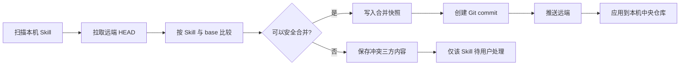

# v0.10.0 多设备同步架构设计

## 1. 版本定位

v0.10.0 为 Skills Hub 增加基于 Git 的跨设备 Skill 库同步。同步以 Skill 为业务单位，以 Git 仓库为版本与传输介质，首版支持 GitHub、GitLab 和 Gitee，默认引导 GitHub，用户可以随时选择其他平台或连接已有仓库。

本功能坚持本地优先：中央 Skill 仓库仍是当前设备的工作副本，远端 Git 仓库保存可移植 Skill 数据与历史。项目关联、AI 工具部署、绝对路径、SQLite、缓存和凭据始终留在本机。

## 2. 已确认产品决策

- 首版只支持 Git，不支持共享文件夹同步。
- 支持 GitHub、GitLab、Gitee；默认 GitHub，允许用户切换。
- 支持连接已有仓库和创建私有同步仓库。
- 三个平台优先提供浏览器 OAuth 授权，并保留 HTTPS Token 与 SSH 高级配置；SSH 私钥由系统 SSH Agent 管理。
- 默认自动检查变化、手动点击“立即同步”；自动同步默认关闭，可由用户开启。
- 同步单位是 Skill，不同步项目或工具部署关系。
- 没有内容变化的同步不创建新版本。
- 优先自动合并；无法证明安全时保留双方版本并交给用户。
- 删除传播为移入回收站，不立即永久删除。
- 新设备已有 Skills 时先识别、比较和合并，不静默覆盖。

## 3. 目标与非目标

### 3.1 目标

- 多台设备共享同一套 Skill 内容、标签、来源和版本历史。
- 使用普通 Git 仓库保存数据，用户可以独立克隆和备份。
- 对单边修改、不同 Skill 修改和安全的文件级修改自动合并。
- 将真正冲突隔离到单个 Skill，其他 Skill 继续同步。
- 所有覆盖、删除和冲突选择之前创建可恢复版本。
- 三个平台复用同一 Git 同步引擎，仅认证和建仓 API 不同。

### 3.2 非目标

- 不同步 `skill_targets`、项目路径、工具启用状态和实际部署结果。
- 不同步应用语言、主题、代理、日志、缓存和自动更新设置。
- 不将 SQLite 数据库提交到 Git。
- 不在首版实现团队权限、共享文件夹协议或服务端同步服务。
- 不尝试自动判断两个只有同名、但没有稳定身份或共同历史的 Skill 是同一个 Skill。

## 4. 用户体验

### 4.1 首次配置

1. 用户打开侧边栏 `Device Sync`。
2. 选择 GitHub、GitLab 或 Gitee，默认选中 GitHub。
3. 点击平台授权按钮，在系统浏览器完成登录授权；应用不接触平台密码。
4. 选择已有仓库或一键创建私有仓库；Token 与 SSH 位于高级设置。
5. 首次同步生成仓库清单并提交当前 Skills。

### 4.2 新设备加入

1. 新设备连接同一仓库。
2. 如果本机库为空，拉取远端 Skills。
3. 如果本机已有 Skills，按稳定 ID、来源和共同历史匹配。
4. 可安全合并的内容自动合并；无法安全合并的 Skill 进入待处理列表。
5. 拉取的 Skill 只进入中央 Skill 仓库，不自动部署到本机项目或 AI 工具。

### 4.3 日常同步

- 应用启动时执行只读检查，用户也可以在同步页手动检查。
- 本机文件变化只更新“待同步”状态，不立即写入远端。
- 点击“立即同步”后执行拉取、比较、合并、提交和推送。
- 自动同步开启时，在应用启动时执行相同流程；首版不做文件修改后的即时推送。

## 5. 同步数据边界

### 5.1 进入 Git 仓库

- Skill 目录全部有效内容：`SKILL.md`、`scripts/`、`references/`、`assets/` 等。
- 稳定 Skill ID、名称、描述、标签、来源类型、来源引用、来源子路径和来源版本。
- 内容哈希、版本关系、删除标记和回收站记录。
- 设备同步身份、展示名和该设备已确认的内容 commit；不包含设备路径或配置。
- 仓库格式版本，不包含应用数据库格式版本。

### 5.2 永不进入 Git 仓库

- SQLite 文件和数据库内部 ID 映射。
- `skill_targets` 及全局/项目部署关系。
- 绝对路径、软链接、Junction、Copy 结果。
- Token、OAuth 凭据、SSH 私钥、代理设置。
- 缓存、日志、错误详情、发现扫描结果和临时文件。

### 5.3 默认忽略

仓库根目录生成 `.gitignore`，排除 `.DS_Store`、临时文件、编辑器缓存、`node_modules`、构建产物和常见密钥文件。后续可以增加 `.skillshubignore`；首版必须在提交前拒绝明显的私钥文件和 `.env`。

## 6. 远端仓库格式

```text
skills-hub-sync/
├── .skills-hub/
│   ├── format.json
│   └── manifest.json
├── skills/
│   └── <stable-skill-id>/
│       ├── skill.json
│       └── content/
│           └── ...
└── .gitignore
```

`format.json` 包含仓库格式版本；`manifest.json` 是当前 Skill 索引；每个 `skill.json` 保存便于人工检查的可移植元数据。删除由 Git 历史表示，本机回收站索引保存在 SQLite，不复制 SQLite。

`skill.json` 仅包含可移植元数据：

```json
{
  "schemaVersion": 1,
  "id": "stable-uuid",
  "name": "frontend-design",
  "description": "...",
  "tags": ["frontend", "design"],
  "source": {
    "type": "git",
    "ref": "https://example.com/org/repo.git",
    "subpath": "skills/frontend-design",
    "revision": "abc123"
  },
  "contentHash": "sha256..."
}
```

## 7. 版本模型

- 每次同步操作有一条本机运行记录，但不一定产生 Git commit。
- 只有可移植 Skill 数据发生变化、自动合并成功或用户解决冲突时才创建 commit。
- Git commit 是仓库级原子版本；commit message 和 trailer 记录设备 ID、变化 Skill ID 和操作类型。
- Skill 的业务版本由其内容哈希与最近修改 commit 表示，不维护容易漂移的独立整数计数器。
- 拉取已有版本、无变化检查和仅本机部署变化不会创建 commit。

### 7.1 内容版本与设备确认状态

- 仓库内容版本与设备确认状态分开表示。设备状态不能仅通过“最后一个 commit 由哪台设备创建”推断。
- 每台设备记录自己已确认的内容版本。设备在无 Skill 变化时完成拉取，也必须能表示“已追上”。
- 每台设备使用独立的命名跟踪 ref 指向已确认的主分支 commit；更新 ref 不创建 commit，不改变 Skill 内容版本。实现使用 GitHub、GitLab 和 Gitee 都可推送的命名分支 ref，不依赖平台私有 API。
- 设备状态更新不得造成设备间无限交替产生新内容版本。
- 页面的“已同步”、“待同步”和“最后活动”必须来自设备明确上报的确认版本，不能用 commit author 或 trailer 猜测。

## 8. Skill 身份识别

匹配优先级：

1. Skills Hub 稳定 UUID。
2. 已记录的共同 Git 历史。
3. 规范化来源 URL、来源子路径和来源版本。
4. 内容哈希完全一致。
5. 名称只用于提示，不作为自动覆盖或合并依据。

只有同名但没有稳定身份或共同历史的条目默认保留两份，并分配不同稳定 ID。

## 9. 同步与合并算法

同步开始时取得三份状态：

- `base`：本机上次成功同步的远端 commit。
- `local`：当前中央 Skill 仓库导出的快照。
- `remote`：拉取后的远端 HEAD。

每个 Skill 独立分类：

| local 与 base | remote 与 base | 结果 |
| --- | --- | --- |
| 相同 | 相同 | 无变化 |
| 不同 | 相同 | 采用 local |
| 相同 | 不同 | 采用 remote |
| 相同修改 | 相同修改 | 合并为同一结果 |
| 双方不同修改 | — | 执行文件级三方合并 |
| 一边删除、一边修改 | — | 冲突 |

文件级合并规则：

- 不同文件修改：自动合并。
- 同一文件被双方修改、二进制文件双方修改、删除与修改：保守地产生冲突。
- 合并后的 Skill 必须仍包含有效 `SKILL.md`，否则转为冲突。

冲突不会把标记写进中央 Skill 文件。同步工作区保留 base/local/remote 三份内容，SQLite 只记录冲突索引和状态。



## 10. 并发控制

- 同一设备使用进程内互斥锁防止两个同步任务并发。
- 推送采用“拉取最新 HEAD → 合并 → 推送”的循环。
- 非 fast-forward 推送重新 fetch 和比较，有限次数重试，不能使用强制推送。
- 仓库写入先在独立同步工作区完成；中央 Skill 仓库只接收验证通过的结果。
- 应用远端 Skill 时使用临时目录加原子重命名，失败时保留原内容。

## 11. 冲突处理

冲突记录包含 Skill ID、base/local/remote commit、冲突文件、创建时间和状态。UI 提供：

- 保留本机版本。
- 使用远端版本。
- 保留两份，本机版本生成新的稳定 ID 和名称，原 ID 采用远端版本。
- 稍后处理。

冲突未解决时，本 Skill 保持本机版本并暂停上传，其他 Skill 继续同步。用户选择“保留本机”后在下次同步生成共同版本；选择远端或保留两份时先更新本机库，再由下一次内容变化同步创建版本。

冲突冻结规则：

- pending 冲突以 Skill ID 为单位冻结；手动同步、自动同步和非 fast-forward 重试都不得上传该 Skill。
- 同步基线推进不得消除冻结状态。只有用户明确选择解决方案后才能解冻。
- 冲突必须保存可读取的 base/local/remote 快照或精确 Git 对象引用。解决时不读取可能已经变化的当前工作区。
- 解决前必须校验远端 HEAD。如果远端又有变化，重新计算冲突，不将新内容套用到旧冲突记录。

## 12. 删除与回收站

- 本机删除已同步 Skill 时生成 tombstone，而不是直接从历史中清除。
- 其他设备同步 tombstone 后，将中央目录移动到本机回收站并删除对应托管记录。
- tombstone 与回收站默认保留 30 天。
- 删除与对端修改同时发生时产生冲突。
- 恢复操作撤销 tombstone，恢复 Skill 内容并创建新 commit。

## 13. Provider 架构

```rust
pub trait GitProvider {
    fn validate_token(&self, token: &str) -> Result<Account>;
    fn list_repositories(&self, token: &str) -> Result<Vec<RemoteRepository>>;
    fn create_private_repository(&self, token: &str, name: &str)
        -> Result<RemoteRepository>;
}
```

- `GitHubProvider`：使用 OAuth Device Flow，无需在桌面应用内保存 client secret。
- `GitLabProvider`：使用 OAuth Device Authorization Grant，OAuth Token 与个人 Token 统一采用 Bearer 访问 API。
- `GiteeProvider`：桌面端调用 Skills Hub 的 HTTPS 授权中转；client secret 只存在服务端，Token 交换结果直接进入本机系统凭据存储。
- Git clone/fetch/push 不进入 Provider，实现统一 `GitTransport`。

所有平台都必须支持授权登录、选择已有仓库与创建私有仓库。未配置 OAuth 客户端时，UI 明确回退到 Token/SSH，而不是把客户端密钥打包进桌面应用。

发布构建通过 `SKILLS_HUB_GITHUB_CLIENT_ID`、`SKILLS_HUB_GITLAB_CLIENT_ID` 和 `SKILLS_HUB_GITEE_AUTH_RELAY_URL` 注入公开配置。GitHub/GitLab 的 client ID 可公开，但绝不向桌面包注入 client secret。

Gitee 中转只承担 OAuth 协议适配，不保存 Skill 或仓库数据：

- `POST /v1/oauth/gitee/device/start` 创建短时授权会话，返回授权地址、用户码、有效期和轮询间隔。
- `POST /v1/oauth/gitee/device/poll` 查询会话；完成后返回 access token、可选 refresh token、有效期和可选 `refresh_url`。
- 会话一次性使用且短时过期；日志禁止记录 code、token 和平台账号隐私字段。

## 14. 凭据与安全边界

- OAuth Token 和手动 HTTPS Token 都使用系统安全凭据存储，SQLite 只保存 credential key。
- OAuth 待授权会话只存在进程内存；页面只接收一次性用户码和 credential key，不接收 access token。
- macOS 对应 Keychain，Windows 对应 Credential Manager，Linux 对应 Secret Service。
- SSH remote 不读取、不复制私钥，只调用系统 SSH Agent/系统 Git。
- Token 只在 API 请求或 Git credential callback 生命周期内进入内存。
- URL、错误和日志输出前移除用户名、Token 和查询参数中的敏感字段。
- 不把 Token 放入 remote URL、Git config、环境持久化文件或 Tauri WebView。

### 14.1 可信主机与凭据绑定

- OAuth 凭据必须绑定 Provider 和官方 Git 主机：GitHub 对应 `github.com`，GitLab 对应 `gitlab.com`，Gitee 对应 `gitee.com`。
- Git credential callback 必须校验 libgit2 实际请求 URL 的主机。主机与凭据绑定不一致时拒绝提供 Token。
- 更换 Provider 或主机后不自动复用原 OAuth/Token 凭据。自建 Git 服务仅通过用户明确配置的 Token 或 SSH 连接。
- 所有仓库 URL 必须规范化后再比较主机，拒绝 userinfo、查询参数、fragment 和主机混淆形式。

### 14.2 远端清单与文件边界

- Git 仓库始终视为不可信输入，即使它是当前用户的私有仓库。
- 读取 Manifest 后必须在任何写入、删除或合并前完成整体验证：格式版本受支持、Map key 等于 Skill ID、ID 是安全单路径段、名称不含路径分隔符、文件路径是规范相对路径。
- 所有计算出的源路径和目标路径必须验证仍位于预期根目录。校验失败时整次同步终止，不做局部写入。
- 本机数据库仍存在 Skill 记录、但中央目录不可读时，必须报错并中止。只有应用内明确完成的删除才能传播。
- `source_ref` 进入仓库前必须去除本机绝对路径、URL userinfo、查询参数和其他凭据信息。

## 15. 后端模块

```text
src-tauri/src/core/device_sync/
├── mod.rs              对外服务与领域 DTO
├── manifest.rs         仓库格式、导入与导出
├── merge.rs            文件级合并和冲突分类
├── git_repo.rs         Git 工作区、commit、fetch、push
├── providers.rs        Provider trait 与注册表
├── credentials.rs      系统安全凭据抽象
└── types.rs            配置、状态、冲突、历史与回收站 DTO
```

`commands/` 只负责参数校验、阻塞任务调度、DTO 转换与错误格式化。业务逻辑全部位于 `core/device_sync/`。

## 16. 数据库迁移

Schema 版本从 6 升级，新增以下本机表：

- `device_sync_config`：Provider、remote URL、branch、自动检查/自动同步开关、credential key、最近成功 commit。
- `device_sync_runs`：开始/结束时间、状态、变化数量和脱敏错误。
- `device_sync_conflicts`：Skill、三方 commit、冲突文件和处理状态。
- `device_sync_devices`：从 commit trailer 发现的设备 ID、名称和最后活动时间。
- `device_sync_tombstones`：本机回收站索引和过期时间。

这些表只保存可重建索引和本机状态，不复制到 Git。

## 17. Tauri IPC

- `get_device_sync_status`
- `get_device_sync_config`
- `save_device_sync_config`
- `validate_device_sync_connection`
- `create_device_sync_repository`
- `check_device_sync_changes`
- `run_device_sync_now`
- `list_device_sync_history`
- `list_device_sync_conflicts`
- `resolve_device_sync_conflict`
- `list_device_sync_trash`
- `restore_device_sync_skill`
- `disconnect_device_sync`

所有 Git、HTTP 和文件扫描操作使用 `spawn_blocking`。错误前缀包括 `SYNC_AUTH|`、`SYNC_CONFLICT|`、`SYNC_NON_FAST_FORWARD|`、`SYNC_INVALID_REPO|` 和 `SYNC_SECRET_FILE|`。

## 18. 前端结构

- `ActiveView` 增加 `device-sync`，侧边栏 Workspace 区增加入口和待处理数量。
- 新增 `DeviceSyncPage`，遵循现有标题栏、侧边栏、统计卡片、平面面板和响应式规则。
- 页面状态：未配置、已同步、有本机变化、有远端变化、正在同步、离线、需要处理、认证失效。
- 配置流程支持 Provider、登录方式、创建/选择仓库、手动/自动同步策略。
- 冲突使用对话框或抽屉展示 base/local/remote 摘要，不在 toast 中承载必须操作的信息。
- 所有文案进入 `src/i18n/resources.ts`，同时提供英文和中文。

## 19. 错误处理与恢复

- 网络失败：保留本机变化，下次重试，不回滚用户文件。
- 认证失败：标记需要重新登录，不删除仓库或凭据索引。
- 非 fast-forward：重新 fetch 和重新规划，禁止 force push。
- 无效远端格式：停止应用并说明仓库不是 Skills Hub 同步仓库。
- 本机磁盘写入失败：中央仓库保持原版本，同步运行标记失败。
- 进程崩溃：下次启动清理带标记的临时目录，并从 Git HEAD 和数据库运行状态恢复。
- 恢复历史版本前先保存当前状态，保证恢复操作可撤销。
- 目录替换使用“新目录预备 → 旧目录备份 → 新目录切换 → 成功后清理备份”顺序；切换失败必须恢复旧目录。
- 导出、合并和冲突快照临时目录使用 RAII 生命周期管理，失败和崩溃恢复后不无限积累。
- 自动检查持久化最近检查时间、变化摘要和错误状态；UI 不得将“未计算”解释为“0 个变化”。

## 20. 测试策略

### 20.1 单元测试

- manifest 序列化、格式版本与敏感字段排除。
- 稳定 ID、来源匹配、同名不同 Skill。
- local/base/remote 全组合规划。
- 不同 Skill、不同文件、同文件不同位置和同一位置冲突。
- 删除、修改与删除冲突、回收站恢复和过期清理。
- 无变化不创建版本。
- Provider URL 规范化、Token 验证和建仓 API mock。
- 日志与错误脱敏。

### 20.2 集成测试

- 使用临时 bare Git 仓库模拟两台设备。
- 初次上传、空设备拉取、非空设备合并。
- 单边修改、双边安全合并、非 fast-forward 重试。
- 同一 Skill 冲突隔离和保留两份。
- 删除传播、删除与修改冲突、恢复。
- 大文件、二进制文件、大小写路径、Unicode 名称、断网和损坏仓库。
- 凭据不进入数据库、日志、remote URL 和 Git 历史。

### 20.3 前端测试

- Provider 默认值与切换。
- 未配置、检查中、可同步、同步中、冲突和认证失效状态。
- 自动同步默认关闭。
- 冲突操作、稍后处理、回收站恢复和错误恢复。
- 中英文文案与窄窗口布局。

## 21. 分阶段实施

1. 仓库格式、数据库迁移、状态 DTO 和本地导出。
2. 本地 bare Git 端到端同步、版本和恢复。
3. 三方规划、自动合并、冲突与回收站。
4. Provider API、凭据存储和网络 Git transport。
5. Device Sync 页面、配置、历史与冲突 UI。
6. 自动检查、可选自动同步、完整测试与发布验证。

## 22. 验收标准

- GitHub、GitLab、Gitee 可选择并连接已有仓库，也可创建私有仓库。
- GitHub 是默认 Provider，切换后配置可持久化。
- 初次同步、新设备空库和非空库均不静默覆盖。
- 只同步 Skill 与可移植元数据；仅上报设备 ID、展示名和已确认内容版本，不同步部署、本机路径或设备配置。
- 无变化同步不创建 commit。
- 安全变更自动合并，真正冲突只阻塞对应 Skill。
- 删除进入回收站并可以恢复。
- Token 不进入 SQLite、日志、Git config 或 Git 历史。
- UI 使用当前 Skills Hub 设计体系，并具备中英文文案。
- `npm run version:check` 与 `npm run check` 全部通过。
